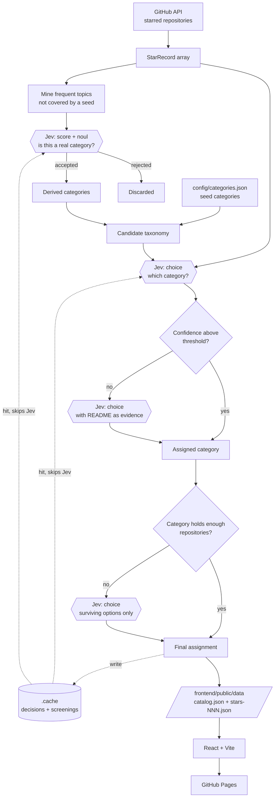

# My Stars Atlas

A browsable catalog of my starred GitHub repositories, categorized end to end by a
decision model. No keyword rules, no manual category assignments, no hand-tuned scores.

**Live site:** https://sametcn99.github.io/my-stars-atlas

## How it works

A Bun script fetches every starred repository, asks [Jev](https://typesafe.ai) — TypeSafe AI's
System One decision model, served through [OpenRouter](https://openrouter.ai/typesafe/jev-1.13) —
which category each one belongs to, and writes a static JSON catalog. A React app reads that
catalog and renders it. GitHub Actions runs the whole thing weekly and deploys to Pages.

Jev is not a chat model. It never emits prose: it takes a piece of state and typed questions,
and returns a choice, a rubric score, or a boolean probability, each with a calibrated
probability distribution. That makes it a good fit for classification, and it is the reason
every decision in this project carries a confidence value.

## Architecture



Hexagons are Jev calls; everything else is plain TypeScript.

### 1. Fetch

`src/github.ts` pages through `/users/{user}/starred` and normalizes each entry into a
`StarRecord`. A cheap count pre-check short-circuits the run when the star count has not
changed; `--force` skips it.

### 2. Taxonomy

The option set Jev chooses from has two sources:

- **Seed categories** — `config/categories.json`, each with an `id`, `title` and
  `description`. The description is passed to Jev verbatim as that option's criteria, so
  it is the only tuning surface in the project.
- **Derived categories** — labels mined from the repositories' own GitHub topics. Any topic
  frequent enough and not already covered by a seed becomes a candidate.

Candidates are not filtered by a hand-written blocklist. Instead, Jev screens each one in a
single request with two questions: a rubric score for how useful the label is as a top-level
category, and a boolean for whether it merely names a technology. Labels like `hacktoberfest`
and `react` are rejected by the model, not by a list someone has to maintain.

### 3. Classification

Every repository is sent to Jev as a small state object (name, owner, description, topics,
language, homepage, stars, archived, fork) with one `choice` question over the full candidate
taxonomy. The answer's probability becomes the repository's confidence.

Two refinement passes follow:

- **README pass** — repositories whose confidence falls below the configured threshold are
  re-evaluated with a truncated README added to the state. The new answer is kept only if it
  is more confident than the original.
- **Pruning and re-asking** — categories that attracted fewer repositories than
  `minCategorySize` are dropped, and the repositories they held are asked again against the
  surviving options. If that second answer is also weak, the README pass applies to it too.

### 4. Output

`src/index.ts` writes `frontend/public/data/catalog.json` (taxonomy, counts, SEO metadata)
plus `stars-NNN.json` chunks of 100 repositories each, along with the web manifest, robots
and sitemap files. The frontend loads the manifest first and streams chunks on demand, so the
initial render never waits on the full dataset.

### Caching

Classification results are cached in `.cache/jev-classifications.json`, keyed by a hash of
the repository fields Jev sees, the taxonomy, and the model id. Changing any of them
invalidates the affected entries. Topic screening verdicts are cached separately, keyed by
the label alone, since whether `self-hosted` is a good category does not depend on the corpus.

The cache is never committed. CI restores and saves it through `actions/cache`, and a
`no_cache` workflow input forces a full reclassification.

## Project layout

| Path                     | Purpose                                                  |
| ------------------------ | -------------------------------------------------------- |
| `src/index.ts`           | Pipeline entry point: fetch, classify, write outputs     |
| `src/github.ts`          | GitHub REST client for stars and READMEs                 |
| `src/jev.ts`             | Jev decisions client (`choice`, `score`, `noul`) + retry |
| `src/taxonomy.ts`        | Seed categories, topic mining, Jev screening, pruning    |
| `src/classify.ts`        | Classification passes, logging, statistics               |
| `src/cache.ts`           | On-disk decision cache                                   |
| `src/config.ts`          | Config loading, validation, CLI flags, paths             |
| `config/categories.json` | Seed taxonomy (ids, titles, descriptions)                |
| `config/config.json`     | GitHub account, classification tuning, site and SEO      |
| `frontend/`              | React + Vite single-page app                             |

Both config files have JSON Schemas next to them, so editors validate and autocomplete them.

## Running locally

Requires [Bun](https://bun.sh) 1.3+ and an OpenRouter API key with credit.

```bash
bun install
cp .env.example .env   # then fill in OPENROUTER_API_KEY
bun run update         # fetch + classify + write data
bun run dev            # serve the site at localhost
```

A full run over ~1000 repositories takes a few minutes and costs roughly $0.10 at Jev's
$0.042 per million input tokens. Subsequent runs are nearly free because unchanged
repositories come from the cache.

### Commands

| Command             | Description                                       |
| ------------------- | ------------------------------------------------- |
| `bun run update`    | Regenerate the catalog data                       |
| `bun run dev`       | Vite dev server                                   |
| `bun run build`     | Regenerate data, then build the site into `dist/` |
| `bun run preview`   | Preview the production build                      |
| `bun run typecheck` | `tsc --noEmit`                                    |
| `bun run check`     | Typecheck, then Biome lint and format             |

### Flags

| Flag         | Effect                                                       |
| ------------ | ------------------------------------------------------------ |
| `--dry-run`  | Classify and report, write nothing                           |
| `--limit N`  | Only process the first N repositories, for cheap experiments |
| `--force`    | Skip the star count pre-check and refetch everything         |
| `--no-cache` | Ignore the cache and reclassify from scratch                 |
| `--verbose`  | Log every individual decision instead of periodic progress   |

Decision logs go to stderr. With `--verbose` each line shows the chosen category, its
probability, and the runner-up options:

```
sametcn99/foo -> ai 0.93 | next: developer-tools 0.04, cli 0.01
bar/baz readme -> cli 0.71 (was frontend 0.31)
qux/quux reprompt -> libraries 0.55 (was dotnet)
```

## Configuration

`config/config.json` holds everything tunable. The classification block:

| Key                                 | Default                                     | Meaning                                               |
| ----------------------------------- | ------------------------------------------- | ----------------------------------------------------- |
| `model`                             | `typesafe/jev-1.13`                         | Decision model id                                     |
| `baseUrl`                           | `https://openrouter.ai/api/alpha/decisions` | Decisions endpoint                                    |
| `concurrency`                       | `12`                                        | Parallel requests                                     |
| `minTopicCount`                     | `8`                                         | Repositories a topic needs before it is a candidate   |
| `maxDerivedCategories`              | `25`                                        | Cap on topic-derived categories                       |
| `derivedCategoryMinScore`           | `2`                                         | Minimum rubric score for a topic to become a category |
| `minCategorySize`                   | `5`                                         | Below this, a category is pruned                      |
| `enableReadmeFallback`              | `true`                                      | Re-ask weak decisions with the README                 |
| `readmeFallbackConfidenceThreshold` | `0.4`                                       | What counts as weak                                   |
| `readmeCharacterLimit`              | `8000`                                      | README characters sent to Jev                         |

To correct a misclassification, sharpen the relevant category's `description` in
`config/categories.json`. That text is the model's criteria; there is nothing else to tune.

## Deployment

`.github/workflows/deploy-pages.yml` runs weekly and on manual dispatch: install, restore the
decision cache, regenerate data, typecheck, build, and deploy to GitHub Pages. It needs one
repository secret, `OPENROUTER_API_KEY`; `GITHUB_TOKEN` is provided by Actions. The dispatch
inputs `force` and `no_cache` map to the CLI flags of the same name.
